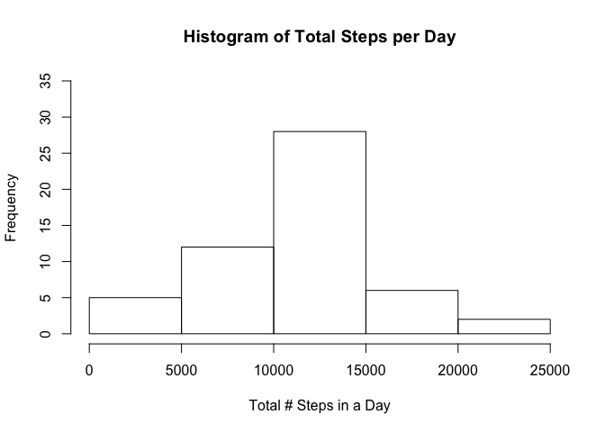
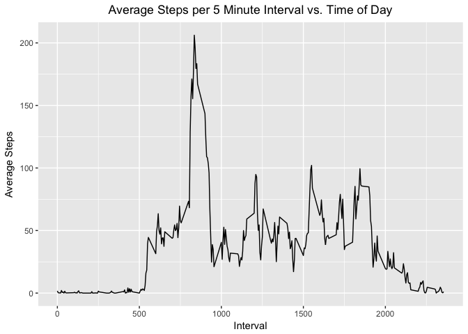
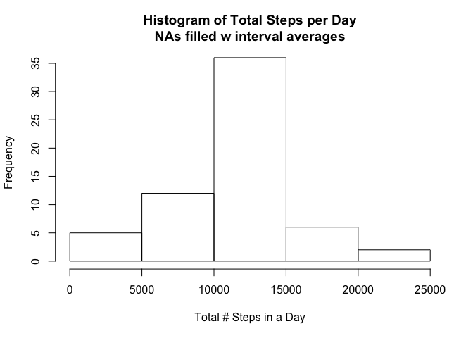
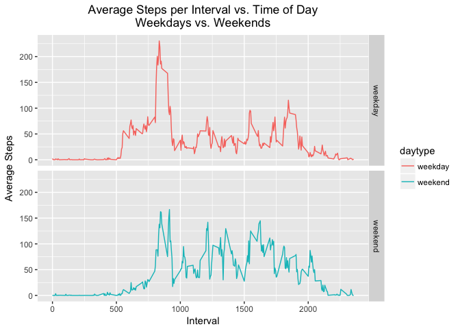

# Reproducible Research: Peer Assessment 1


## Loading and preprocessing the data
We load the Activity data from the CSV file 'activity.csv'.
We then add the number of steps within each day, and assign names to
the columns of the resulting data structure.

```r
activity <- read.csv("activity.csv", header = TRUE)
totalStepsPerDay <- aggregate(steps ~ date, data = activity, sum)
```


## What is mean total number of steps taken per day?
Histogram of the Total Steps per Day:

```r
hist(totalStepsPerDay$steps,
     ylim = c(0, 35),
     xlab = "Total # Steps in a Day",
     ylab = "Frequency",
     main = "Histogram of Total Steps per Day")
```

<!-- -->

Central tendency of Total Steps per Day:
--  Mean = 1.0766189\times 10^{4}
--  Median = 10765


## What is the average daily activity pattern?
To find the average pattern of activity, in terms of steps per 5 minute interval,
we average the number of steps in each individual interval over all of the days
in the dataset.

```r
meanStepsPerInterval <- aggregate(steps ~ interval, data = activity, mean)
```

We can then plot the average in each interval versus the time of day.

```r
g <- ggplot(meanStepsPerInterval, aes(interval, steps))
g <- g + geom_line()
g <- g + labs(x = "Interval")
g <- g + labs(y = "Average Steps")
g <- g + ggtitle("Average Steps per 5 Minute Interval vs. Time of Day")
g <- g + theme(plot.title = element_text(hjust = 0.5))
print(g)
```

<!-- -->

We can find the 5 minute interval with the highest average number of steps via:

```r
intervalIndex <- which.max(meanStepsPerInterval$steps)
maximumActivityInterval <- meanStepsPerInterval$interval[intervalIndex]
maximumAverageSteps <- meanStepsPerInterval$steps[intervalIndex]
```

The results are:
*  Interval with the maximum average number of steps:  835
*  Number of steps in the average most active interval:  206.1698113


## Imputing missing values
The total number of missing values in the activity table is  2304.

To serve as proxy for those missing step counts, we replace the NAs with
the average over the other days for the corresponding interval, and store
the "cleaned" data in a new table.

```r
naIndices <- which( is.na(activity$steps), arr.ind = TRUE )
meanIndices <- (naIndices - 1) %% nrow(meanStepsPerInterval)  +  1

newActivity <- activity
newActivity$steps[naIndices] <- meanStepsPerInterval$steps[meanIndices]
newActivity$date <- as.Date(newActivity$date)
```

We can remake the histogram of total number of steps per day, now with the
missing values replaced by interval averages.

```r
newTotalStepsPerDay <- aggregate(steps ~ date, data = newActivity, sum)
hist(newTotalStepsPerDay$steps,
     ylim = c(0, 35),
     xlab = "Total # Steps in a Day",
     ylab = "Frequency",
     main = "Histogram of Total Steps per Day\nNAs filled w interval averages" )
```

<!-- -->


The resulting central tendency of Total Steps per Day, after filling the NAs:
*  Mean = 1.0766189\times 10^{4}
*  Median = 1.0766189\times 10^{4}


## Are there differences in activity patterns between weekdays and weekends?
In order to see differences between weekday activity and weekend activity,
we add a new column indicating weekday or weekend for each date in the dataset.

```r
flag <- weekdays(newActivity$date)  %in%  c("Saturday", "Sunday")
newActivity$daytype <- ifelse(flag, "weekend", "weekday")
newActivity$daytype <- as.factor(newActivity$daytype)
```

With that new flag, we can repeat the mean characterization of activity
according to the weekday-weekend split.

```r
meanStepsPerInterval <- aggregate(steps ~ interval + daytype,
                                  data = newActivity,
                                  mean)
```

We then break the time series plots of average activity into two panels,
one for an average weekday activity profile, and the other for weekends.
Weekends are characterized by the start of activity being shifted to later
times in the morning, peak activity being lower, and activity continuing
later into the evening.

```r
g <- ggplot(meanStepsPerInterval, aes(interval, steps))
g <- g + facet_grid(daytype ~ .)
g <- g + aes(color = daytype)
g <- g + geom_line()
g <- g + labs(x = "Interval")
g <- g + labs(y = "Average Steps")
g <- g + ggtitle("Average Steps per Interval vs. Time of Day\nWeekdays vs. Weekends")
g <- g + theme(plot.title = element_text(hjust = 0.5))
print(g)
```

<!-- -->


